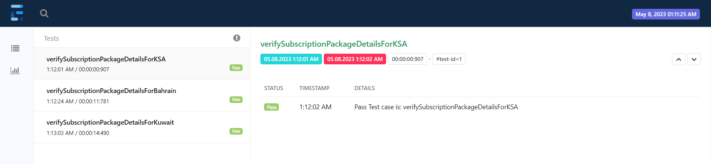
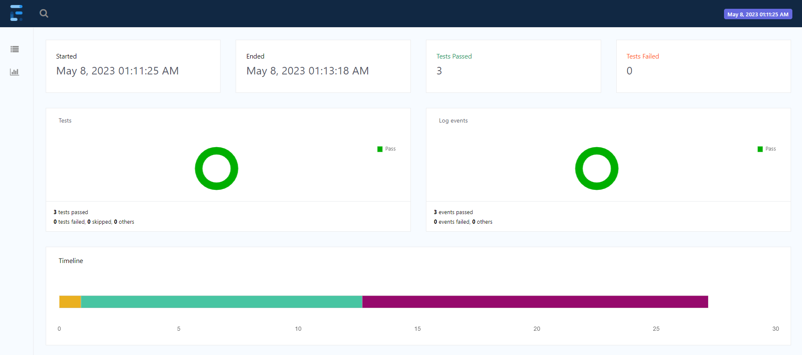
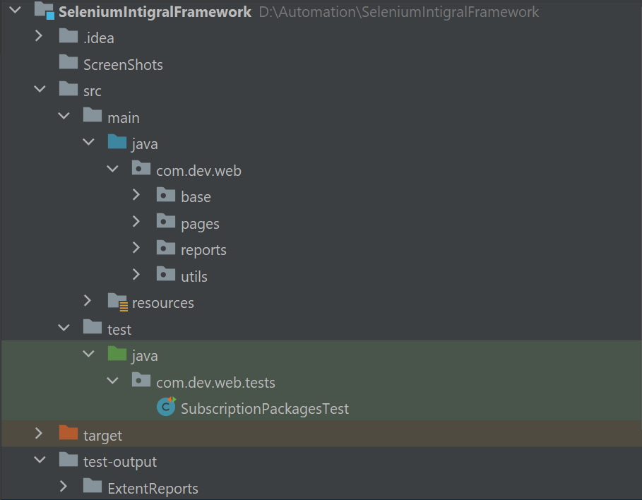

# SeleniumWebAutomationFramework

This is a Java-based web automation framework that uses Selenium WebDriver to automate web applications. This framework is designed to be modular, reusable, and easy to maintain.

<h3>Requirements:</h3>

Java Development Kit (JDK) 11 or higher

Apache Maven 3.3 or higher

ChromeDriver or GeckoDriver etc.

Selenium WebDriver Java bindings

<h3>Framework Features:</h3>

Modular architecture using the Page Object Model design pattern

Support for multiple browsers (Chrome, Firefox and IE)

Configuration using properties file

Test data driving using JSON 

Test Reporting using ExtentReports

<h3>How to run the tests:</h3>
1.Clone the repository(https://github.com/devqa07/SeleniumIntigralFramework.git) from GitHub

2.Install the required software (JDK, Maven, ChromeDriver/GeckoDriver, Selenium WebDriver Java bindings).

3.Open the project in your preferred IDE (e.g. IntelliJ IDEA or Eclipse).

4.Modify the config.properties file in the src/main/resources directory to run the tests in chrome, firefox browsers.

5.We can run the individual tests from src/test/com.dev.web.tests/SubscriptionPackagesTest class or Simply run `mvn clean install` command, also complete suite can be executed with testng.xml.

6.After test execution, test reports can be viewed in the /test-output/ExtentReports/ExtentReports.html directory.

<h3>Framework Structure:</h3>
The framework is structured as follows:

* src/main/java/base: Contains the class which define the Selenium driver initialization, loadConfig from property file methods and extent reports related methods.
* src/main/java/pages: Contains the page class(locators and functions) for the web application under test.
* src/main/java/reports:Contains report related classes and methods to generate the extent report after execution.
* src/main/java/utils:Contains classes having methods/functions like CommonActions,Constants, JSONHelper and ListenerClass.
* src/main/resources: Contains the browser drivers, testData and config properties file.
* src/test/java: Contains the test class(source code of the application under test).
* test-output/ExtentReports: Contains the test execution reported generated by ExtentReports.
* ScreenShots:Contains the screenshots of the failed tests

